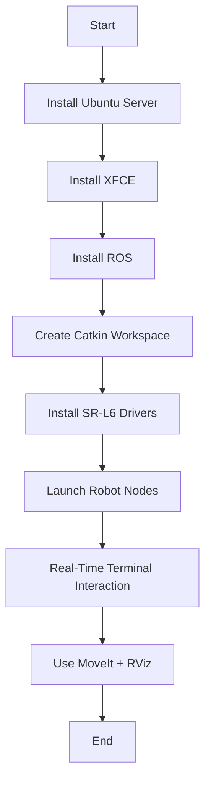

# Optimal Setup for Controlling Savya Robotics SR‑L6 6‑DoF Robot Arm Using Ubuntu Server, ROS, and XFCE

This guide provides **step‑by‑step implementation**, **all Bash commands**, and **full configuration** in one place. Follow these steps on a fresh Ubuntu Server installation.

---

# ✅ 1. Install Ubuntu Server & Update System

```bash
sudo apt update && sudo apt upgrade -y
sudo apt install git curl wget net-tools build-essential -y
```

---

# ✅ 2. Install XFCE (Lightweight GUI)

XFCE gives you a low‑resource GUI on top of Ubuntu Server.

```bash
sudo apt install xfce4 xfce4-goodies -y
```

### Install a Display Manager (LightDM)

```bash
sudo apt install lightdm -y
```

Select **LightDM** when prompted.

Reboot:

```bash
sudo reboot
```

---

# ✅ 3. Install ROS (Recommended: ROS Noetic for Ubuntu 20.04)

## Step 3.1 – Add ROS Repository

```bash
sudo sh -c "echo 'deb http://packages.ros.org/ros/ubuntu $(lsb_release -sc) main' > /etc/apt/sources.list.d/ros-latest.list"
```

## Step 3.2 – Add Keys

```bash
sudo apt install curl -y
curl -s https://raw.githubusercontent.com/ros/rosdistro/master/ros.asc | sudo apt-key add -
```

## Step 3.3 – Update Repos

```bash
sudo apt update
```

## Step 3.4 – Install ROS

```bash
sudo apt install ros-noetic-desktop-full -y
```

---

# ✅ 4. Initialize rosdep

```bash
sudo rosdep init
rosdep update
```

---

# ✅ 5. Setup ROS Environment

Append environment setup to `.bashrc`:

```bash
echo "source /opt/ros/noetic/setup.bash" >> ~/.bashrc
source ~/.bashrc
```

---

# ✅ 6. Create a Catkin Workspace

```bash
mkdir -p ~/catkin_ws/src
cd ~/catkin_ws
catkin_make
```

Add workspace to `.bashrc`:

```bash
echo "source ~/catkin_ws/devel/setup.bash" >> ~/.bashrc
source ~/.bashrc
```

---

# ✅ 7. Install Dependencies for SR‑L6 Robot Arm

Assuming the vendor provides a ROS package.

Typical dependencies:

```bash
sudo apt install ros-noetic-ros-control ros-noetic-ros-controllers \
ros-noetic-industrial-core ros-noetic-moveit ros-noetic-rviz -y
```

Clone SR‑L6 ROS driver (example path):

```bash
cd ~/catkin_ws/src
git clone https://github.com/savya-robotics/sr-l6-ros-driver.git
```

Build:

```bash
cd ~/catkin_ws
catkin_make
```

---

# ✅ 8. Launch the SR‑L6 Robot Driver

```bash
roslaunch sr_l6_driver bringup.launch
```

---

# ✅ 9. Real‑Time Terminal Interaction (Examples)

### Enable Robot

```bash
rosservice call /sr_l6/enableRobot
```

### Disable Robot

```bash
rosservice call /sr_l6/disableRobot
```

### Read Joint Angles

```bash
rostopic echo /sr_l6/joint_states
```

### Send Joint Command Example

```bash
rostopic pub /sr_l6/joint_cmd std_msgs/Float64MultiArray "data: [0, 0.5, -0.3, 1.2, 0.4, 0]"
```

---

# ✅ 10. Install MoveIt for Motion Planning

MoveIt is used for motion planning, IK, FK, trajectory generation.

```bash
sudo apt install ros-noetic-moveit -y
```

Launch MoveIt + RViz:

```bash
roslaunch sr_l6_moveit_config demo.launch
```

---

# ✅ 11. Running GUI Apps on XFCE

Open terminal in GUI:

```
Applications → Terminal Emulator
```

Run RViz:

```bash
rviz
```

---

# 📌 Mermaid Diagram



---

# 🎯 Conclusion

Ubuntu Server + ROS + XFCE gives the **best balance of performance, stability, and real-time robot control** for the Savya Robotics SR‑L6 robot arm.

This file includes **all steps**, **all Bash commands**, and **full flow** needed for implementation.
