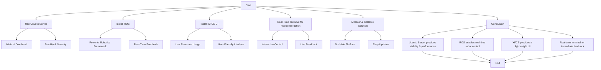

# `Optimal Setup for Controlling Savya Robotics SR-L6 6-DoF Robot Arm Using Ubuntu Server, ROS, and XFCE`

## Why Use Ubuntu Server with ROS and XFCE for Controlling the Savya Robotics SR-L6 6-DoF Robot Arm

Using **Ubuntu Server** with **ROS** (Robot Operating System) and a **lightweight XFCE UI** provides an optimal setup for controlling and interacting with the **Savya Robotics SR-L6 6-DoF Robot Arm**. Here’s why this combination is suitable for real-time robot control and user convenience:

## 1. **Efficiency of Ubuntu Server**
- **Minimal Overhead**: Ubuntu Server is a minimalistic version of Ubuntu, optimized for performance without the overhead of unnecessary graphical environments. This leaves more system resources available for running robot control software like ROS.
- **Stability & Security**: Ubuntu Server is widely used in industrial and robotics applications for its stability, security, and large community support.
  
## 2. **ROS for Real-Time Robot Control**
- **Powerful Robotics Framework**: ROS provides a comprehensive framework for robot control, including motion planning, sensor integration, and real-time communication between nodes. It allows precise control over the **SR-L6 robot arm**.
- **Real-Time Feedback**: ROS supports real-time communication, allowing for direct interaction with the robot. You can send commands, receive feedback, and monitor the arm’s status in real-time.
  
## 3. **Lightweight XFCE UI for User Convenience**
- **Low Resource Usage**: XFCE is a lightweight desktop environment that uses minimal system resources, making it ideal for controlling robotics applications without overloading the system.
- **User-Friendly Interface**: Although Ubuntu Server doesn’t include a GUI by default, XFCE allows you to add a simple, intuitive interface for controlling the robot. This provides easy access to system settings, terminal windows, and real-time status updates.
  
## 4. **Real-Time Terminal for Robot Interaction**
- **Interactive Control**: With a **real-time terminal** in Ubuntu, you can directly interact with the **SR-L6 robot arm** using ROS commands. This allows you to send commands, track joint positions, and monitor the robot's performance in real-time.
- **Live Feedback**: Real-time logs and robot data (e.g., joint angles, velocity) can be continuously displayed in the terminal, allowing for immediate adjustments and monitoring of the robot's behavior.

## 5. **Modular and Scalable Solution**
- **Scalability**: The combination of Ubuntu Server and ROS provides a scalable platform for adding new capabilities, sensors, or even additional robots. This modular setup allows easy expansion as your robot’s needs grow.
- **Easy Updates**: Both Ubuntu and ROS provide straightforward methods for updating and upgrading software, ensuring that your system remains up-to-date with the latest features and security patches.

---

## **Conclusion**
Using **Ubuntu Server** with **ROS** and a **lightweight XFCE UI** is an ideal setup for controlling the **Savya Robotics SR-L6 6-DoF Robot Arm**. It balances system efficiency, real-time control, and user convenience:
1. **Ubuntu Server** provides a resource-efficient and stable environment for running ROS.
2. **ROS** ensures precise, real-time interaction with the robot arm.
3. **XFCE** gives users a minimal yet functional UI for monitoring and controlling the robot.
4. The **real-time terminal** allows immediate feedback and interaction with the robot, making development and operations easier.

This setup ensures that you can manage the robot effectively without compromising on performance or ease of use.

